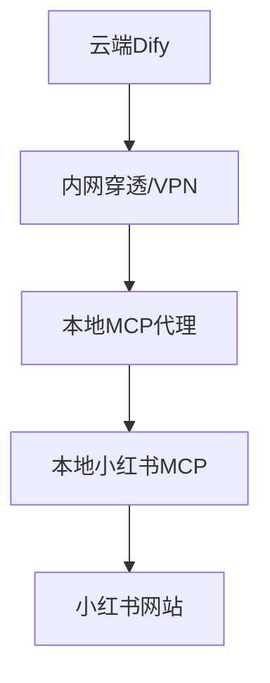
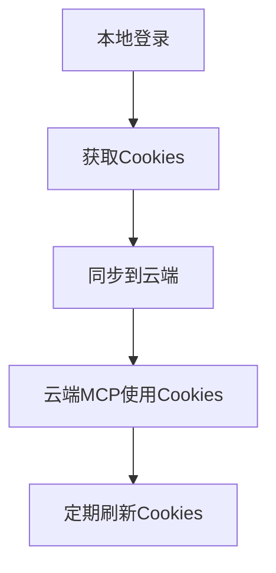

# Dify集成小红书MCP指南

## 🎯 **核心问题解答**

**问题**: Dify要调用小红书MCP，是否必须部署到本地？

**答案**: 不一定！有多种解决方案可选择。

## 🏗️ **架构方案对比**

### 方案一：完全本地部署 ⭐ **最简单**


**部署步骤**：
```bash
# 1. 本地部署Dify
git clone https://github.com/langgenius/dify.git
cd dify/docker
docker-compose up -d

# 2. 启动本地MCP
cd /path/to/xiaohongshu-mcp
.\start-mcp.ps1

# 3. 在Dify中配置MCP
# URL: http://localhost:18060/mcp
```

**优势**：
- ✅ 完全可控
- ✅ 数据安全
- ✅ 无网络延迟
- ✅ 可以看到登录界面

**劣势**：
- ❌ 需要本地资源
- ❌ 不能远程访问

### 方案二：云端Dify + 本地MCP代理 🌐 **最灵活**



**实现步骤**：

#### 1. 启动本地MCP
```powershell
# 启动小红书MCP
.\start-mcp.ps1
```

#### 2. 启动MCP代理服务器
```bash
# 安装依赖
npm run install-deps

# 启动代理服务器
npm start
# 或者开发模式
npm run dev
```

#### 3. 配置内网穿透
```bash
# 使用ngrok
ngrok http 8080

# 或使用frp
./frpc -c frpc.ini
```

#### 4. 在云端Dify中配置
```json
{
  "mcp_endpoint": "https://your-tunnel-url.ngrok.io/mcp"
}
```

### 方案三：Cookie同步机制 🔄 **最自动化**



## 🛠️ **推荐实施方案**

### 阶段一：快速验证（本地部署）
```bash
# 1. 本地部署Dify
docker-compose -f dify-local.yml up -d

# 2. 启动本地MCP
.\start-mcp.ps1

# 3. 测试集成
curl http://localhost:3000/api/dify-test
```

### 阶段二：生产环境（混合架构）
```bash
# 1. 云端Dify + 本地MCP代理
# 2. 使用内网穿透或VPN
# 3. 配置负载均衡和故障转移
```

## 📋 **具体操作步骤**

### 步骤1: 准备本地环境
```powershell
# 检查本地MCP状态
.\start-mcp.ps1 -Check

# 如果未运行，启动MCP
.\start-mcp.ps1

# 验证MCP健康状态
curl http://localhost:18060/health
```

### 步骤2: 安装代理服务器
```bash
# 安装Node.js依赖
npm run install-deps

# 启动代理服务器
npm start
```

### 步骤3: 配置内网穿透
```bash
# 方法1: 使用ngrok
ngrok http 8080

# 方法2: 使用frp
# 配置frpc.ini后运行
./frpc -c frpc.ini

# 方法3: 使用花生壳等服务
```

### 步骤4: 在Dify中配置MCP
```json
{
  "tools": [
    {
      "name": "xiaohongshu-mcp",
      "type": "api",
      "endpoint": "https://your-tunnel-url/mcp",
      "auth": {
        "type": "none"
      }
    }
  ]
}
```

## 🔧 **代理服务器配置**

### 环境变量
```bash
# .env文件
PORT=8080
LOCAL_MCP_URL=http://localhost:18060
LOG_LEVEL=info
```

### 启动脚本
```powershell
# start-proxy.ps1
$env:PORT="8080"
$env:LOCAL_MCP_URL="http://localhost:18060"
npm start
```

## 🚀 **快速开始**

### 1分钟快速测试
```bash
# 1. 启动本地MCP
.\start-mcp.ps1

# 2. 启动代理服务器
npm start

# 3. 测试代理
curl http://localhost:8080/health

# 4. 配置Dify使用代理
# 在Dify中设置MCP URL为: http://localhost:8080/mcp
```

## 🔍 **故障排除**

### 常见问题

#### 1. 代理服务器无法连接本地MCP
```bash
# 检查本地MCP状态
.\start-mcp.ps1 -Check

# 检查端口占用
netstat -an | findstr 18060
```

#### 2. Dify无法访问代理服务器
```bash
# 检查防火墙设置
# 检查内网穿透状态
# 验证代理服务器健康状态
curl http://localhost:8080/health
```

#### 3. 登录状态丢失
```bash
# 重新登录本地MCP
# 检查Cookie有效期
# 重启MCP服务
.\start-mcp.ps1 -Restart
```

## 📊 **性能优化**

### 缓存策略
- 登录状态缓存
- API响应缓存
- 图片下载缓存

### 负载均衡
- 多个本地MCP实例
- 请求分发策略
- 故障转移机制

## 🎯 **最佳实践建议**

### 开发阶段
1. **使用完全本地部署** - 快速迭代和调试
2. **启用详细日志** - 便于问题排查
3. **定期备份Cookies** - 避免重复登录

### 生产阶段
1. **使用混合架构** - 云端Dify + 本地MCP
2. **配置监控告警** - 及时发现问题
3. **实施自动重启** - 提高服务可用性

## 🔐 **安全考虑**

### 网络安全
- 使用HTTPS加密传输
- 配置访问白名单
- 启用API认证

### 数据安全
- 本地存储敏感数据
- 定期更新登录凭证
- 监控异常访问

---

## 📝 **总结**

**Dify调用小红书MCP的最佳方案**：

1. **开发测试**: 完全本地部署
2. **生产环境**: 云端Dify + 本地MCP代理
3. **企业级**: Cookie同步 + 集群部署

选择哪种方案取决于您的具体需求：
- **简单快速**: 方案一
- **灵活扩展**: 方案二  
- **企业级**: 方案三

需要我帮您实施哪种方案？