# 小红书MCP - 开发部署指南

## 📋 系统要求

### 基础环境
- **操作系统**: Windows 10/11, macOS, Linux
- **Go版本**: 1.19+
- **Node.js**: 16.0+
- **浏览器**: Chrome/Chromium
- **PowerShell**: 5.0+ (Windows)

### 网络要求
- 能够访问小红书网站
- 如需Dify集成，需要内网穿透能力

## 🚀 快速部署

### 一键启动（推荐）

#### Windows PowerShell
```powershell
# 基本启动
.\start-mcp.ps1

# 编译后启动
.\start-mcp.ps1 -Build

# 检查服务状态
.\start-mcp.ps1 -Check

# 重启服务
.\start-mcp.ps1 -Restart

# 停止服务
.\start-mcp.ps1 -Stop
```

#### Linux/macOS
```bash
# 添加执行权限（首次使用）
chmod +x start-mcp.sh

# 启动服务
./start-mcp.sh

# 编译后启动
./start-mcp.sh --build
```

#### Windows 批处理
```cmd
# 双击运行或命令行执行
start-mcp.bat
```

### 手动部署

#### 1. 环境准备
```bash
# 检查Go版本
go version

# 安装依赖
go mod tidy

# 检查端口占用
netstat -an | findstr 18060
```

#### 2. 编译运行
```bash
# 开发模式
go run . server

# 编译后运行
go build -o xiaohongshu-mcp.exe .
.\xiaohongshu-mcp.exe server
```

#### 3. 验证部署
```bash
# 健康检查
curl http://localhost:18060/health

# MCP端点测试
curl -X POST http://localhost:18060/mcp \
  -H "Content-Type: application/json" \
  -d '{"jsonrpc":"2.0","id":1,"method":"initialize","params":{}}'
```

## 🔧 开发环境配置

### IDE集成

#### Trae IDE
```powershell
# 一键安装MCP配置
.\quick-install.ps1

# 或完整安装
.\install-trae-mcp.ps1
```

#### VS Code
```json
// .vscode/mcp.json
{
  "mcpServers": {
    "xiaohongshu-mcp": {
      "url": "http://localhost:18060/mcp",
      "description": "小红书内容发布服务",
      "type": "http",
      "timeout": 30000
    }
  }
}
```

#### Claude Desktop
```json
// claude_desktop_config.json
{
  "mcpServers": {
    "xiaohongshu-mcp": {
      "command": "go",
      "args": ["run", ".", "server"],
      "cwd": "/path/to/xiaohongshu-mcp"
    }
  }
}
```

### 环境变量配置
```bash
# 浏览器路径（可选）
export BROWSER_PATH="/usr/bin/chromium"

# 无头模式（可选）
export HEADLESS=true

# 服务端口（可选）
export PORT=18060

# 日志级别（可选）
export LOG_LEVEL=info
```

## 🌐 Dify集成部署

### 架构方案

#### 方案一：本地Dify + 本地MCP（推荐开发）

```mermaid
graph LR
    A[本地Dify] --> B[本地MCP]
    B --> C[小红书]
```


```bash
# 1. 部署本地Dify
git clone https://github.com/langgenius/dify.git
cd dify/docker
docker-compose up -d

# 2. 启动本地MCP
.\start-mcp.ps1

# 3. 配置Dify MCP
# URL: http://localhost:18060/mcp
```

#### 方案二：云端Dify + 内网穿透（推荐生产）

```mermaid
graph LR
    A[云端Dify] --> B[内网穿透]
    B --> C[本地MCP代理]
    C --> D[本地MCP]
```


```bash
# 1. 启动本地MCP
.\start-mcp.ps1

# 2. 启动MCP代理服务器
npm install
npm start

# 3. 配置内网穿透
# 选择以下任一方案：
```

### 内网穿透方案

#### LocalTunnel（当前使用）
```bash
# 安装
npm install -g localtunnel

# 启动隧道
lt --port 8080 --subdomain xiaohongshu-mcp-test

# 获得URL: https://xiaohongshu-mcp-test.loca.lt
```

#### Ngrok（备选方案）
```bash
# 安装ngrok
# 启动隧道
ngrok http 8080

# 获得临时URL
```

### Dify MCP配置

#### 推荐配置（SSE）
```json
{
  "xiaohongshu-mcp-server": {
    "transport": "sse",
    "url": "https://xiaohongshu-mcp-test.loca.lt/mcp",
    "timeout": 30,
    "headers": {
      "Content-Type": "application/json",
      "Accept": "application/json, text/event-stream"
    }
  }
}
```

#### 备选配置（HTTP）
```json
{
  "xiaohongshu-mcp-server": {
    "transport": "streamable_http",
    "url": "https://xiaohongshu-mcp-test.loca.lt/mcp"
  }
}
```

## 🐳 Docker部署

### 构建镜像
```bash
# 构建Docker镜像
docker build -t xiaohongshu-mcp .

# 运行容器
docker run -d \
  --name xiaohongshu-mcp \
  -p 18060:18060 \
  -v $(pwd)/cookies:/app/cookies \
  xiaohongshu-mcp
```

### Docker Compose
```yaml
# docker-compose.yml
version: '3.8'
services:
  xiaohongshu-mcp:
    build: .
    ports:
      - "18060:18060"
    volumes:
      - ./cookies:/app/cookies
    environment:
      - HEADLESS=true
    restart: unless-stopped
```

## 🔧 故障排除

### 常见问题

#### 1. 端口占用
```bash
# 检查端口占用
netstat -an | findstr 18060

# 杀死占用进程
taskkill /F /PID <PID>
```

#### 2. Go模块下载失败
```bash
# 设置代理
go env -w GOPROXY=https://goproxy.cn,direct

# 或使用网络代理
$Env:http_proxy="http://127.0.0.1:7890"
$Env:https_proxy="http://127.0.0.1:7890"
```

#### 3. 浏览器启动失败
```bash
# 检查Chrome路径
where chrome

# 设置浏览器路径
export BROWSER_PATH="/path/to/chrome"
```

#### 4. MCP连接失败
```bash
# 检查服务状态
curl http://localhost:18060/health

# 检查MCP端点
curl -X POST http://localhost:18060/mcp \
  -H "Content-Type: application/json" \
  -d '{"jsonrpc":"2.0","id":1,"method":"initialize","params":{}}'
```

### 日志调试
```bash
# 启用详细日志
export LOG_LEVEL=debug

# 查看实时日志
tail -f logs/xiaohongshu-mcp.log
```

## 📊 性能优化

### 资源配置
```bash
# 设置Go运行时参数
export GOMAXPROCS=4
export GOGC=100

# 设置内存限制
export GOMEMLIMIT=1GiB
```

### 缓存优化
- 登录状态缓存：24小时
- 图片下载缓存：本地存储
- API响应缓存：5分钟

### 并发控制
- 最大并发请求：10
- 请求超时：30秒
- 重试次数：3次

## 🔐 安全配置

### 网络安全
```bash
# 启用HTTPS（生产环境）
export TLS_CERT_FILE="/path/to/cert.pem"
export TLS_KEY_FILE="/path/to/key.pem"

# 设置访问白名单
export ALLOWED_IPS="127.0.0.1,192.168.1.0/24"
```

### 数据安全
- Cookies本地加密存储
- 敏感信息环境变量配置
- 定期清理临时文件

## 📈 监控告警

### 健康检查
```bash
# 定期健康检查脚本
#!/bin/bash
while true; do
  if ! curl -f http://localhost:18060/health; then
    echo "Service unhealthy, restarting..."
    ./start-mcp.ps1 -Restart
  fi
  sleep 60
done
```

### 日志监控
```bash
# 监控错误日志
tail -f logs/error.log | grep -i "error\|fail\|exception"
```

## 🚀 生产部署清单

### 部署前检查
- [ ] 系统资源充足（CPU 2核+, 内存 4GB+）
- [ ] 网络连接稳定
- [ ] 防火墙端口开放（18060, 8080）
- [ ] SSL证书配置（如需HTTPS）
- [ ] 监控告警配置

### 部署步骤
1. [ ] 环境准备和依赖安装
2. [ ] 代码部署和编译
3. [ ] 配置文件设置
4. [ ] 服务启动和验证
5. [ ] 内网穿透配置
6. [ ] Dify集成测试
7. [ ] 监控告警配置
8. [ ] 备份恢复测试

### 部署后验证
- [ ] 服务健康检查通过
- [ ] MCP工具列表正常
- [ ] 登录功能正常
- [ ] 发布功能正常
- [ ] 搜索功能正常
- [ ] Dify集成正常

---

## 📞 技术支持

如遇到部署问题，请提供以下信息：
1. 操作系统版本
2. Go版本信息
3. 错误日志内容
4. 网络环境描述
5. 部署步骤记录

**联系方式**: 请在GitHub Issues中提交问题