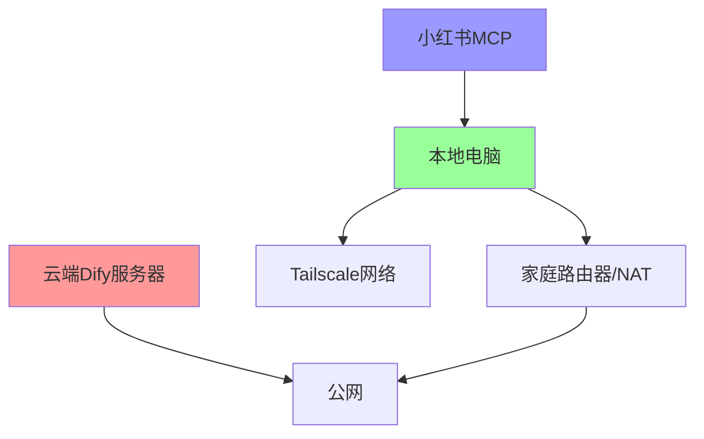

# 混合架构技术方案详解

## 🌐 **当前网络环境分析**



**挑战**：
- 🔴 云端Dify无法直接访问本地MCP
- 🔴 本地没有固定公网IP
- 🔴 家庭网络在NAT后面
- 🟢 本地有Tailscale（但云端没有）

## 🚀 **四种内网穿透解决方案**

### 方案一：Ngrok（最简单）⭐ **推荐新手**


**优势**：
- ✅ 配置简单，一条命令搞定
- ✅ 自动HTTPS证书
- ✅ 稳定可靠
- ✅ 有免费版本

**劣势**：
- ❌ 免费版有连接数限制
- ❌ 域名会变化（除非付费）

### 方案二：Cloudflare Tunnel（最稳定）⭐ **推荐生产**


**优势**：
- ✅ 完全免费
- ✅ 固定域名
- ✅ 全球CDN加速
- ✅ 自动HTTPS
- ✅ 高可用性

**劣势**：
- ❌ 需要域名（可用免费域名）
- ❌ 配置稍复杂

### 方案三：FRP自建（最可控）🔧 **推荐技术派**


**优势**：
- ✅ 完全可控
- ✅ 无限制
- ✅ 可自定义域名
- ✅ 支持多种协议

**劣势**：
- ❌ 需要VPS服务器
- ❌ 需要维护服务器

### 方案四：Tailscale Funnel（最优雅）🌟 **推荐进阶**


**优势**：
- ✅ 利用现有Tailscale
- ✅ 安全性最高
- ✅ 配置简单
- ✅ 免费

**劣势**：
- ❌ 需要Tailscale付费版（Funnel功能）

## 🛠️ **推荐实施路线**

### 阶段一：快速验证（Ngrok）
```bash
# 1分钟快速测试
ngrok http 8080
```

### 阶段二：稳定部署（Cloudflare Tunnel）
```bash
# 生产环境推荐
cloudflared tunnel create mcp-tunnel
```

### 阶段三：企业级（FRP自建）
```bash
# 完全可控的企业方案
./frps -c frps.ini
```

## 📋 **详细实施步骤**

### 步骤1: 准备本地环境
```powershell
# 1. 启动本地MCP
.\start-mcp.ps1

# 2. 启动MCP代理服务器
npm start

# 3. 验证本地服务
curl http://localhost:8080/health
```

### 步骤2: 选择穿透方案
根据需求选择上述四种方案之一

### 步骤3: 配置云端Dify
```json
{
  "mcp_endpoint": "https://your-tunnel-url/mcp"
}
```

## 🔧 **技术细节**

### 网络流量路径
```
云端Dify → 穿透服务 → 本地代理 → 本地MCP → 小红书
```

### 安全考虑
- 🔐 HTTPS加密传输
- 🔑 API密钥认证
- 🛡️ 访问频率限制
- 📊 日志监控

### 性能优化
- ⚡ 连接池复用
- 💾 响应缓存
- 🔄 自动重连
- 📈 负载均衡

---

*下面将提供每种方案的具体实现代码和配置文件*