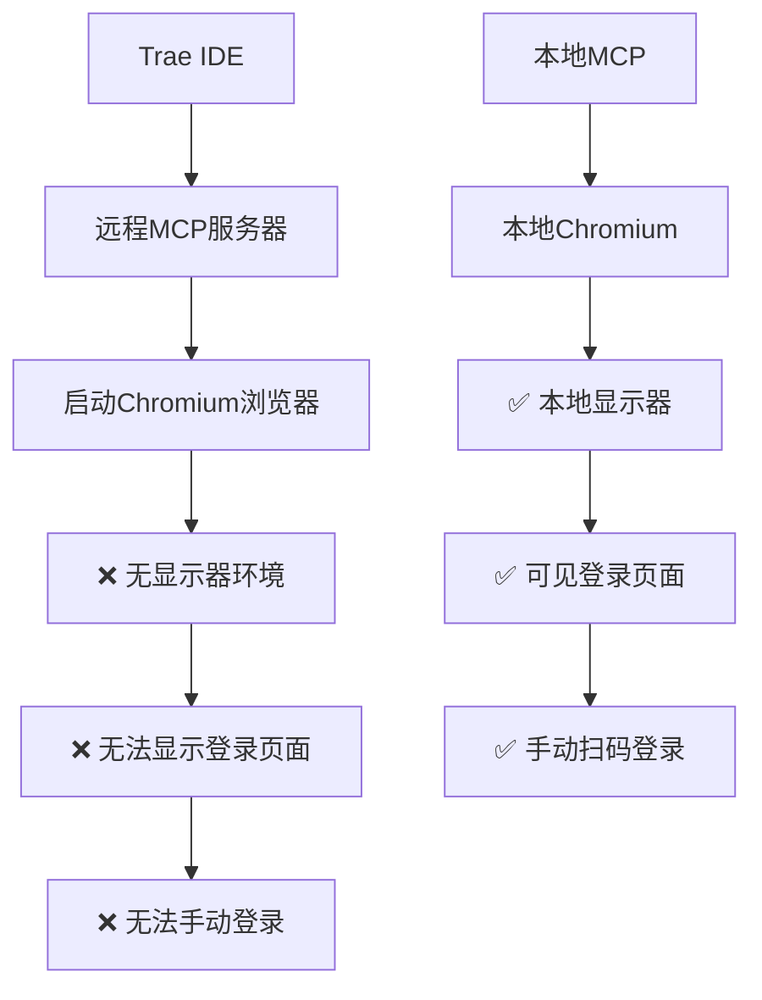

# 远程MCP服务诊断报告

## 🔍 问题概述

通过SSH连接到远程服务器 `100.73.120.70` 检查小红书MCP服务，发现了关键问题。

## 📊 服务状态检查

### ✅ 正常运行的部分
- **容器状态**: MCP容器正在运行 (`xiaohongshu-mcp`)
- **健康检查**: HTTP健康检查端点正常 (`/health`)
- **网络连接**: 端口18060正常监听
- **基础服务**: Go应用程序正常启动

### ❌ 发现的问题

#### 1. 容器健康状态异常
```bash
# 容器状态显示为 "unhealthy"
79faf572cc88   xiaohongshu-mcp-xiaohongshu-mcp   Up About an hour (unhealthy)
```

#### 2. MCP端点访问问题
```bash
# MCP端点返回404错误
[GIN] 2025/09/30 - 13:35:02 | 404 | GET "/mcp"
[GIN] 2025/09/30 - 13:35:57 | 404 | POST "/mcp"
```

#### 3. 浏览器环境缺失 🎯 **核心问题**
```bash
# 容器内没有安装Chromium浏览器
ls: cannot access '/usr/bin/chromium*': No such file or directory

# 没有显示环境变量
env | grep DISPLAY  # 无输出
```

## 🔑 **关键发现：登录机制分析**

### 问题的根本原因

**您的疑惑是正确的！** 小红书MCP的登录机制确实是问题的关键：

#### 🖥️ **服务器端登录 vs 本地端登录**

1. **远程服务器模式**（当前配置）:
   - MCP服务运行在远程服务器上
   - 浏览器需要在**服务器端**启动
   - 登录页面在**服务器端**显示
   - **问题**: 服务器是无头环境，没有显示器

2. **本地模式**（推荐方案）:
   - MCP服务运行在本地
   - 浏览器在**本地**启动
   - 登录页面在**本地**显示
   - **优势**: 可以看到登录界面，手动操作

### 🎯 **为什么远程MCP无法正常工作**



## 🛠️ 解决方案

### 方案一：修复远程服务器环境（复杂）

1. **安装虚拟显示器**:
```bash
# 在服务器上安装Xvfb
apt-get update
apt-get install xvfb

# 设置虚拟显示
export DISPLAY=:99
Xvfb :99 -screen 0 1024x768x24 &
```

2. **安装VNC服务器**:
```bash
# 安装VNC以便远程查看浏览器
apt-get install x11vnc
x11vnc -display :99 -bg -forever -nopw -quiet
```

3. **重新构建Docker镜像**:
```dockerfile
# 添加浏览器和显示支持
RUN apt-get update && apt-get install -y \
    chromium-browser \
    xvfb \
    x11vnc
```

### 方案二：使用本地MCP（推荐）⭐

1. **停用远程MCP配置**:
```json
// 在 %APPDATA%\Trae\mcp.json 中
{
  "mcpServers": {
    "xiaohongshu-mcp": {
      "url": "http://100.73.120.70:18060/mcp",
      "type": "streamableHttp",
      "disabled": true  // 禁用远程
    }
  }
}
```

2. **启用本地MCP**:
```json
// 在项目 .trae\mcp.json 中
{
  "mcpServers": {
    "xiaohongshu-mcp": {
      "url": "http://localhost:18060/mcp",
      "type": "sse",
      "disabled": false  // 启用本地
    }
  }
}
```

3. **本地启动MCP**:
```powershell
# 使用本地启动脚本
.\start-mcp.ps1
```

### 方案三：混合模式（最佳实践）

1. **开发阶段**: 使用本地MCP进行登录和测试
2. **生产阶段**: 将已登录的cookies同步到远程服务器
3. **自动化**: 远程服务器使用保存的cookies进行自动化操作

## 📋 推荐操作步骤

### 立即解决方案

1. **切换到本地MCP**:
```powershell
# 1. 检查本地MCP状态
.\start-mcp.ps1 -Check

# 2. 如果未运行，启动本地MCP
.\start-mcp.ps1

# 3. 验证本地MCP工具可用性
# 在Trae中测试MCP工具
```

2. **验证登录功能**:
```powershell
# 使用本地MCP进行登录测试
# 可以看到浏览器窗口和二维码
```

3. **配置文件调整**:
```json
// 确保Trae使用本地配置
// 项目级配置优先于全局配置
```

## 🔧 长期解决方案

1. **Cookie同步机制**: 开发本地到远程的cookie同步工具
2. **无头登录**: 实现基于API的登录方式
3. **会话管理**: 建立长期有效的登录会话机制

## 📝 结论

**您的直觉是完全正确的！** 登录网页的显示位置确实是问题的关键：

- **远程MCP**: 浏览器在服务器端启动，无法看到登录界面
- **本地MCP**: 浏览器在本地启动，可以正常看到和操作登录界面

**建议**: 立即切换到本地MCP模式，这样您就可以正常使用所有功能了。

---

*诊断时间: 2025年9月30日*  
*服务器: 100.73.120.70 (Armbian ARM64)*  
*状态: 服务运行但功能受限*